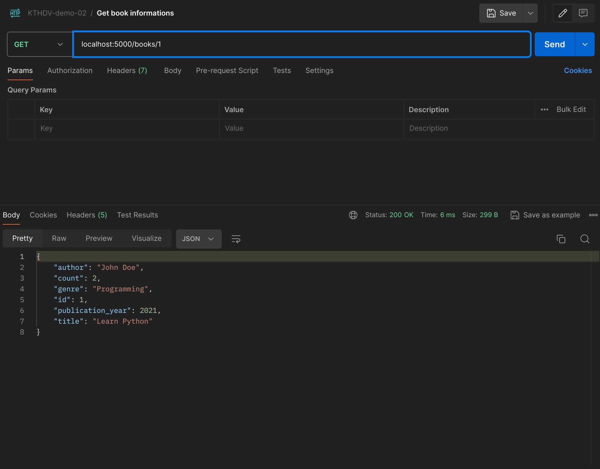

### Các nguyên tắc cơ bản của RESTful API áp dụng trong demo
- Uniform interface: dữ liệu trả về ở định dạng JSON, ví dụ
```json
{
    "book_id": 1,
    "book_title": "Learn Python",
    "checkout_date": "2025-10-01",
    "loan_id": 1,
    "return_date": null,
    "user_id": 2,
    "user_name": "Bao Nguyen"
}
```
- Kiến trúc client-server: Server backend đảm nhận lưu trữ, tương tác dữ liệu còn giao diện người dùng (client) sẽ phát triển độc lập -> dễ mở rộng, bảo trì


- Stateless: Các request từ client đến server phải chứa đầy đủ thông tin cần thiết để server hiểu và xử lý, server không lưu trữ context của client giữa các request.

- Ngoài ra còn các nguyên tắc khác như Code on demand, Cacheable, Layered System chưa có trong demo

### Test các REST API mẫu

Liệt kê các users: GET `http://localhost:5000/users`


Thêm sách vào trong hệ thống: POST `localhost:5000/books`


Liệt kê sách có trong hệ thống: GET `localhost:5000/books`


Xem thông tin cụ thể của sách với id tương ứng: GET `localhost:5000/books/{book-id}`


Tạo một loan với book_id và user_id: POST `localhost:5000/loans`


Cập nhật thời hạn trả sách của một loan: PUT `localhost:5000/loans/{loan-id}`


Lấy thông tin của một loan: GET `http://localhost:5000/loans/1`
