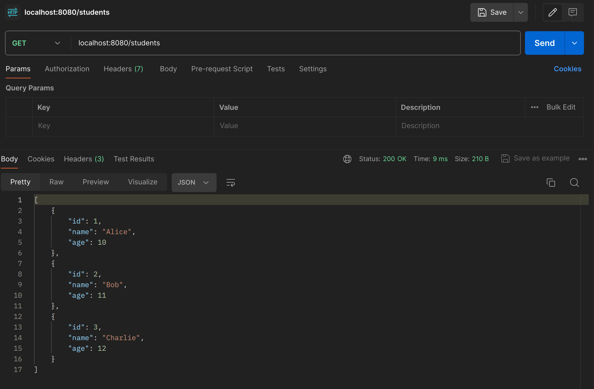

### Extensibility
Extensibility thể hiện qua việc định nghĩa tài nguyên và sử dụng HTTP chuẩn trong REST API. Không cố định hành vi bằng endpoint cụ thể như /createUser hay /deleteUser mà chỉ cần định nghĩa tài nguyên như /users và dùng các HTTP method chuẩn (GET, POST, DELETE, v.v) -> Tức là khi ta muốn mở rộng hệ thống thêm nhiều loại resource mới thì chỉ cần thêm qua các endpoint mới như /payments, /reviews, một cách khác là mở rộng field JSON

Quan trọng nhất của extensibility còn là khả năng thiết kế API sao cho DỄ MỞ RỘNG và KHÔNG PHÁ VỠ CÁI CŨ

### Demo cho extensibility
Demo cho tính chất này sẽ gồm các phần:

1. Demo thêm các trường trả về trong cùng một loại resource, endpoint

Ban đầu API `GET /students` trả về các bản ghi về học sinh với các trường cơ bản như `id`, `name`, `age` 

Nhưng sau đó mở rộng thêm các trường `grade`, `email` mà không thay đổi endpoint hoặc cấu trúc cũ.

2. Demo thêm các phiên bản trả về cho cùng một loại resource, endpoint

Khi API được dùng bởi nhiều client ta không thể thay đổi cấu trúc response hoặc logic, điều đó có thể khiến ứng dụng client bị lỗi

Bởi vậy một API dù có cùng một loại resource, cùng một mục đích vẫn có thể tồn tại nhiều version khác nhau bởi các yếu tố như
- Thay đổi schema
- Thay đổi business logic
- Tối ưu hiệu năng cho một mục đích
- Đổi format

Ví dụ như với endpoint `GET /v1/students`, ta trả về các trường `id`, `name`, `age`

Tuy nhiên với `GET /v2/students` các trường trả về lại là `student_id`, `full_name`, `age` và `class`

