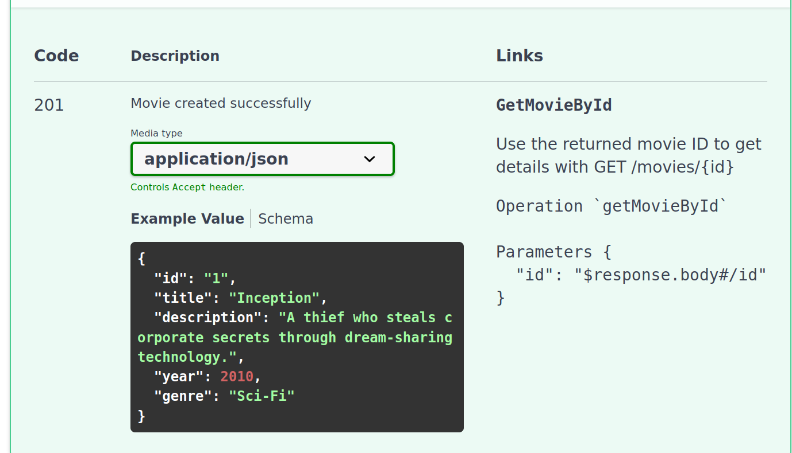

## Overview
OpenAI Specification (OAS) là file mô tả API, thường ở dạng `.yaml` hoặc `.json`. Nó không phải là code mà là bản thiết kế để người khác hiểu API có gì, request, response ra sao

Ví dụ ngắn về OpenAPI 3.0


```yaml
openapi: 3.0.3
info:
  title: Movie Search API
  version: 1.0.0
servers:
  - url: http://localhost:8080
paths:
  /movies:
    get:
      summary: Get all movies
      responses:
        "200":
          description: List of movies
          content:
            application/json:
              schema:
                type: array
                items:
                  $ref: "#/components/schemas/Movie"
    post:
      summary: Add a new movie
      requestBody:
        required: true
        content:
          application/json:
            schema:
              $ref: "#/components/schemas/Movie"
      responses:
        "201":
          description: Movie created
  /movies/{id}:
    get:
      summary: Get movie by ID
      parameters:
        - name: id
          in: path
          required: true
          schema:
            type: string
      responses:
        "200":
          description: Movie details
          content:
            application/json:
              schema:
                $ref: "#/components/schemas/Movie"

components:
  schemas:
    Movie:
      type: object
      properties:
        id:
          type: string
        title:
          type: string
        description:
          type: string
        year:
          type: integer
        genre:
          type: string
```

Để demo thì có thể dán mô tả ví dụ ở trên vào trên https://editor.swagger.io/


### 5 Endpoint mẫu với chủ đề Movie API

1. GET /movies: Lấy danh sách phim
2. GET /movies/{id}: Lấy chi tiết thông tin về 1 phim ứng với ID
3. POST /movies: Thêm phim mới
4. PUT /movies/{id}: Cập nhật thông tin phim
5. DELETE /movies/{id}: Xoá phim


Khung OpenAPI cơ bản sẽ bắt đầu với cấu trúc
```yaml
openapi: 3.0.3
info:
  title: Movie API
  version: 1.0.0
servers:
  - url: http://localhost:8080
```

Tiếp tới ta định nghĩa schema cho đối tượng "Movie", vì phần này dùng được cho nhiều endpoint nên ta đặt ở `components/schemas`
```yaml
components:
  schemas:
		Movie:
			type: object
			required: [title, year]
			properties:
				id:
					type: string
					example: "1"
				title:
					type: string
					example: "Inception"
				description:
          type: string
          example: "A thief who steals corporate secrets through dream-sharing technology."
        year:
          type: integer
          example: 2010
        genre:
        	type: string
          example: "Sci-Fi"
```

Tiếp tới ta viết các endpoint (`paths` theo cách gọi của OpenAPI) 
1. GET /movies
```yaml
paths:
	/movies:
		get:
			summary: Get all movies
			responses:
				"200":
					description: A list of movies
          content:
          	application/json:
          		schema:
          			type: array
          			items:
          				$ref: "#/components/schemas/Movie"
```

2. GET /movies/{id}
```yaml
	/movies/{id}:
		get:
			summary: Get movie's information by given ID
			parameters:
				- name: id
					in: path
					required: true
					schema:
						type: string
			responses:
				"200":
					description: Movie details
					content:
						application/json:
							schema:
								$ref: "#/components/schemas/Movie"
				"404":
					descriptin: Movie not found
```

3. POST /movies
Operation này chung path với GET /movies nên ta không định nghĩa lại path của nó mà thêm vào ngay dưới spec của GET /movies
```yaml
		post:
			summary: Add a new movie
			requestBody:
				required: true
				content:
					application/json:
						schema:
							$ref: "#/components/schemas/Movie"
			responses:
				"201":
					description: Movie created successfully
```

4. PUT /movies/{id}
Operation này chung path với GET /movies/{id} nên ta không định nghĩa lại path của nó mà thêm vào ngay dưới spec của GET /movies/{id}
```yaml
		put:
			summary: Update movie details
			parameters:
				- name: id
					in: path
					required: true
					schema:
						type: string
			requestBody:
				required: true
				content:
					application/json
						schema:
							$ref: "#/components/schemas/Movie"
			responses:
				"200":
					description: Movie updated
				"404":
					description: Movie not found
```

5. DELETE /movies/{id} 
```yaml
		delete:
			summary: Delete movie
			parameters:
				- name: id
					in: path
					required: true
					schema:
						type: string
			requestBody:
				required: true
				content:
					application/json
						schema:
							$ref: "#/components/schemas/Movie"
			responses:
				"204":
					description: Movie deleted successfully
				"404":
					description: Movie not found
```


Ghép lại ta được file OpenAPI specification hoàn chỉnh như sau
```yaml
openapi: 3.0.3
info:
  title: Movie API
  version: 1.0.0
servers:
  - url: http://localhost:8080

paths:
  /movies:
    get:
      summary: Get all movies
      responses:
        "200":
          description: A list of movies
          content:
            application/json:
              schema:
                type: array
                items:
                  $ref: "#/components/schemas/Movie"
    post:
      summary: Add a new movie
      requestBody:
        required: true
        content:
          application/json:
            schema:
              $ref: "#/components/schemas/Movie"
      responses:
        "201":
          description: Movie created successfully

  /movies/{id}:
    get:
      summary: Get a movie by ID
      parameters:
        - name: id
          in: path
          required: true
          schema:
            type: string
      responses:
        "200":
          description: Movie details
          content:
            application/json:
              schema:
                $ref: "#/components/schemas/Movie"
        "404":
          description: Movie not found
    put:
      summary: Update movie details
      parameters:
        - name: id
          in: path
          required: true
          schema:
            type: string
      requestBody:
        required: true
        content:
          application/json:
            schema:
              $ref: "#/components/schemas/Movie"
      responses:
        "200":
          description: Movie updated
        "404":
          description: Movie not found
    delete:
      summary: Delete a movie by ID
      parameters:
        - name: id
          in: path
          required: true
          schema:
            type: string
      responses:
        "204":
          description: Movie deleted successfully
        "404":
          description: Movie not found

components:
  schemas:
    Movie:
      type: object
      required: [title, year]
      properties:
        id:
          type: string
          example: "1"
        title:
          type: string
          example: "Inception"
        description:
          type: string
          example: "A thief who steals corporate secrets through dream-sharing technology."
        year:
          type: integer
          example: 2010
        genre:
          type: string
          example: "Sci-Fi"
```

Phần links trong OpenAPI 3.0 là một tính năng ít được sử dụng, cho phép mô tả mối quan hệ giữa các endpoint kiểu như sau khi gọi API A, bạn có thể tiếp tục gọi API B

Ví dụ như mình tinh chỉnh spec của POST /movies như sau
```yaml
    post:
      summary: Add a new movie
      requestBody:
        required: true
        content:
          application/json:
            schema:
              $ref: "#/components/schemas/Movie"
      responses:
        "201":
          description: Movie created successfully
          content:
            application/json:
              schema:
                $ref: "#/components/schemas/Movie"
          links:
            GetMovieById:
              operationId: getMovieById
              parameters:
                id: "$response.body#/id"
              description: >
                Use the returned movie ID to get details with GET /movies/{id}
```

Kết quả là ở phần Links trên swaggerUI sẽ render liên kết logic giữa endpoint POST /movies với GET /movies/{id}

