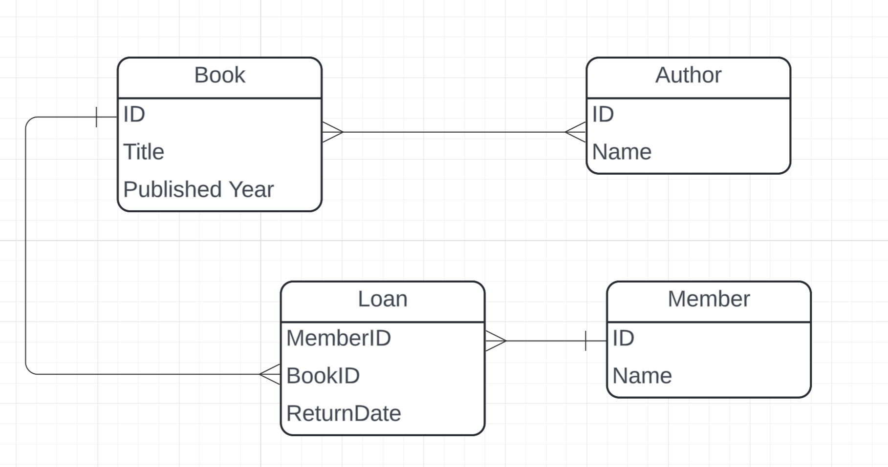

### Thiết kế data model cho hệ thống quản lý thư viện

Bước 1: Xét các entity chính trong domain "quản lý thư viện"
	- Book
	- Author
	- Member
	- Loan: phiếu mượn
	
Bước 2: Xác định các mối quan hệ giữa các entity
	- Book-Author: <m:n> (một quyển sách có thể có nhiều tác giả và một tác giả có thể viết nhiều sách)
	- Member-Loan: <1:n> (một thành viên có thể có nhiều phiếu mượn)
	- Loan được định danh bởi composite key giữa định danh của cả Member và Book (Loan ID := Member_ID + Book_ID)

Entity Relationship Diagram



Bước 3: Thiết kế resource tree cho API

Các resource path của sách
```
/books : liệt kê sách, thêm sách
/books/{id} : xem thông tin của sách cụ thể, update thông tin của sách, xoá sách
```

Các resource path của author
```
/authors : liệt kê tác giả, thêm tác giả
/authors/{id} : xem thông tin của tác giả cụ thể, update thông tin tác giả, xoá tác giả
/authors/{id}/books: liệt kê sách của một tác giả
```

Các resource path của member
```
/members : liệt kê các member, thêm member vào hệ thống (thường được sử dụng bởi admin)
/members/{id} : xem thông tin cụ thể của một member, update thông tin member, xoá member
/members/{id}/loans: xem các phiếu mượn của một member
```

### Phân trang

Sử dụng chiến thuật offset-based pagination, cụ thể thông qua việc sử dụng các tham số trên URL: 
- limit: số lượng bản ghi tối đa cần lấy
- offset: số lượng bản ghi cần bỏ qua trước khi bắt đầu lấy

Ví dụ về http request lấy 10 quyển sách bắt đầu từ quyển thứ 21
```
GET /books?limit=10&offset=20
```

câu lệnh sql tương đương với endpoint trên là
```sql 
SELECT * FROM books
ORDER BY id
LIMIT 10 OFFSET 20;
```

Ưu điểm của cách trên là dễ implement, phù hợp với lượng dữ liệu vừa phải của danh sách sách

Tương tự các resource member và author cũng có chiến thuật phân trang tương tự

```
GET /authors?limit=10&offset=20

GET /members?limit=10&offset=20
```

### Tìm kiếm


**Tìm kiếm sách**:

Endpoint cho tìm kiếm sách có thể thực hiện thông qua việc thêm các query parameter để lọc dữ liệu

- title: tìm theo tên sách (áp dụng matching prefix hoặc suffix)
- genre: tìm theo thể loại
- year: lọc theo năm xuất bản

```
GET /books?title=mockingbird&genre=daily
```


nâng cao hơn có thể làm thêm endpoint chuyên biệt cho tìm kiếm để có thể implement thêm các tính năng nâng cao như full text search hoặc hybrid search, media search
```
GET /search/books?q=economic
```

**Tìm kiếm tác giả**

Endpoint cho tìm kiếm tác giả sử dụng query parameter: name (tên tác giả)

```
GET /authors?name=jeffrey
```


**Tìm kiếm thành viên**

Tương tự, Endpoint cho tìm thành viên sử dụng query parameter

```
GET /members?name=John&email=john@gmail.com
```
