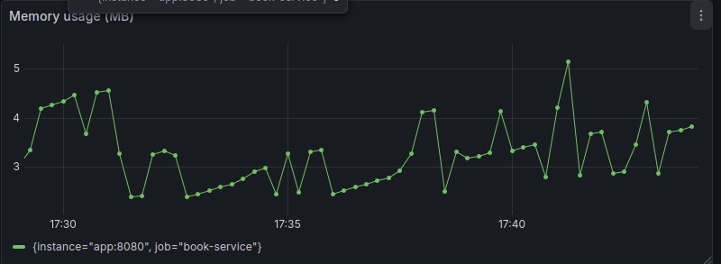
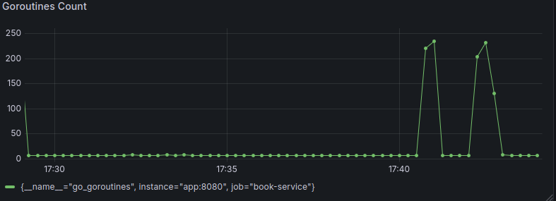
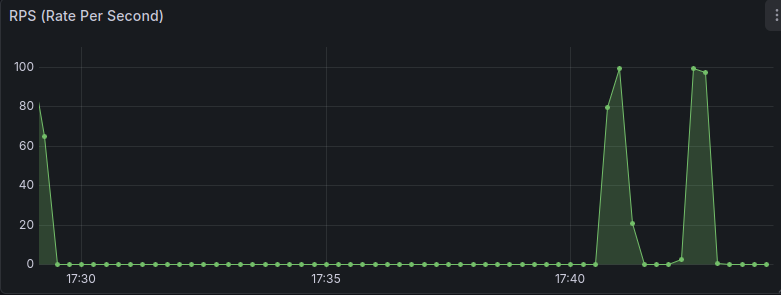
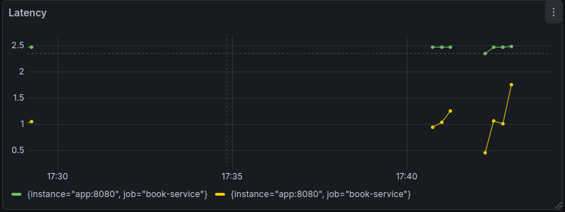
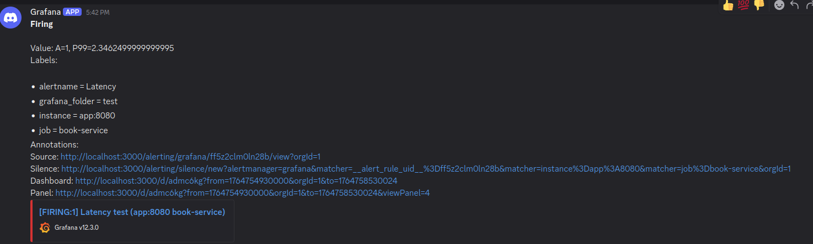

### Panel for observability









### Alert to Discord
If latency (P99) of book requests exceeds 2 seconds, send an alert to Discord.



### Load test
Using vegeta to load testing the API and watch how the metrics change in Grafana.

```bash
vegeta attack -duration=30s -rate=100 -targets=targets.txt
```
