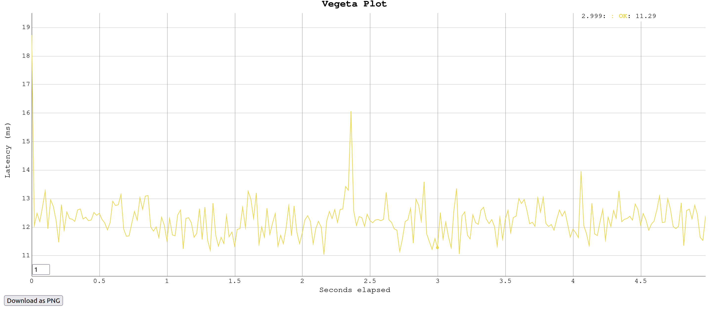
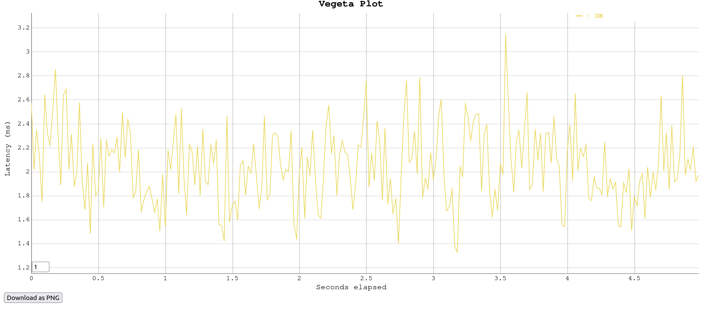

### Vấn đề mẫu cần giải quyết
Giả sử đang làm một project clone Facebook chẳng hạn, có 2 bảng là `users` và `posts` với quan hệ là 1 user có thể có nhiều post (1 - N)

**Cách làm 1**: List toàn bộ n user rồi lấy post của từng user (mỗi lần lấy post của một user là một query) 
-> Cách làm này có vấn đề khi tốn 1 query để lấy users + n query để lấy post của từng user 
-> đây chính là vấn đề n + 1 query, điều này vừa phí tài nguyên mạng dành cho việc truy vấn dữ liệu, vừa tốn thời gian khi phải chờ tận N query nữa mới có đủ dữ liệu các post

Endpoint cho cách làm 1 được đặt tại endpoint `/api/v1/users/posts`

Cách giải quyết cho vấn đề n + 1 query này được trình bày thông qua cách làm 2 

**Cách làm 2**: Sử dụng kĩ thuật `Eager Loading`, đơn giản là load sẵn các dữ liệu liên quan rồi chỉ dùng thêm 1 truy vấn nữa 

Endpoint cho cách làm 2 được đặt tại endpoint `/api/v2/users/posts`

### Thử nghiệm benchmark

Sử dụng vegeta để thử nghiệm benchmark xem độ trễ trung bình của 2 cách implement là như nào

(Kịch bản benchmark là 50 request/s trong vòng 5s)

Kết quả thu được:

Cách 1: n+1 queries

Kết quả
```
Requests      [total, rate, throughput]         250, 50.20, 50.08
Duration      [total, attack, wait]             4.992s, 4.98s, 12.402ms
Latencies     [min, mean, 50, 90, 95, 99, max]  11.049ms, 12.269ms, 12.245ms, 12.931ms, 13.157ms, 13.966ms, 18.744ms
```



Cách 2: eager loading

Kết quả
```
Requests      [total, rate, throughput]         250, 50.20, 50.18
Duration      [total, attack, wait]             4.982s, 4.98s, 1.976ms
Latencies     [min, mean, 50, 90, 95, 99, max]  1.333ms, 2.055ms, 2.019ms, 2.471ms, 2.609ms, 2.809ms, 3.146ms
```




Kết quả trên đã cho thấy cách làm 2 đã giúp p99 latency giảm từ 13ms ở cách 1 xuống còn gần 3ms, cho thấy eager loading là một phương án khả thi giải quyết vấn đề N + 1 query